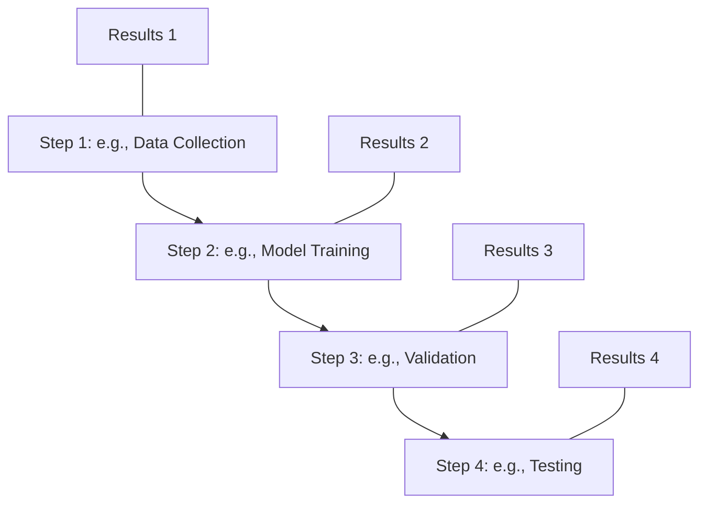

<h1 align="center">
<b>Activity</b> 
Method scrutiny
</h1>

Understanding and critically evaluating the methodology of a scientific paper is crucial for assessing the validity and reliability of its findings. This activity will guide you through the process of mapping out the experimental design, linking methods to results, and critically analyzing the sufficiency of the methodology.

!!! tip
    1. Be objective: Try to assess the methodology based on its scientific merit, not on whether you agree with the conclusions.
    2. Consider the context: Think about the state of the field and available technologies at the time the study was conducted.
    3. Look for justifications: Good papers often explain why specific methods or analyses were chosen.
    4. Think about alternatives: Consider whether there might have been better ways to address the research question.
    5. Be constructive: When identifying limitations, think about how they could be addressed in future studies.

## Instructions

### Create a Flowchart of the Experimental Design

**With:** Your group

!!! warning
    Today's paper did this for us, but I am including it for future reference.

-   Read through the methods section carefully.
-   Identify the main steps of the experimental process.
-   Create a flowchart using the provided template or a tool of your choice.
    -   Start with data collection/preparation
    -   Include key analytical or experimental steps
    -   End with final analyses or validations

Example flowchart structure:

### Analyze Contribution to Research Question

**With:** Your group

Write a brief explanation for each step of how it contributes to answering the main research question.
Consider:

-   What specific aspect of the research question does this step address?
-   How do the results from this step support or refute the hypothesis?
-   Are there any limitations in how this step addresses the research question?

### Critical Evaluation of Methodology

**With:** Your group

Assess the sufficiency and limitations of the methodology by considering the following questions:

-   **Appropriateness:**
    Are the methods suitable for addressing the research question?
    Do the techniques used align with current best practices in the field?
-   **Completeness:**
    Are all necessary controls included?
    Are sample sizes adequate for the conclusions drawn?
-   **Potential Biases:**
    Are there any sources of bias in the experimental design?
    How might these biases affect the results?
-   **Reproducibility:**
    Is there enough detail provided to reproduce the experiments?
    Are any key methodological details missing?
-   **Statistical Analyses:**
    Are the statistical methods appropriate for the data?
    Are the statistical analyses correctly interpreted?
-   **Limitations:**
    What are the main limitations of the methodology?
    How do these limitations affect the interpretation of the results?

!!! warning
    Since this is our first paper, I do not expect you to answer these confidently.
    As you get more experienced you will be mindful of things you have seen in the past.

### Class Discussion

**With:** Everyone

Be prepared to share your group's insights with the class.
Consider:

-   What were the most significant strengths and weaknesses identified in the methodology?
-   Were there any aspects of the methodology that were particularly innovative or noteworthy?
-   How might the authors have improved their experimental design?
